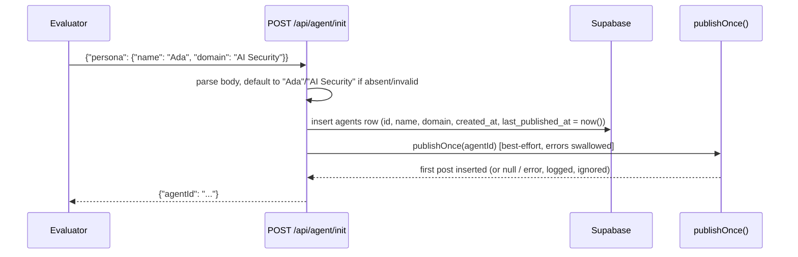
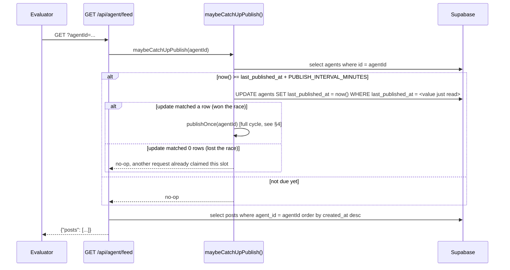
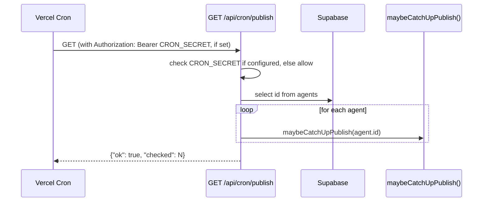
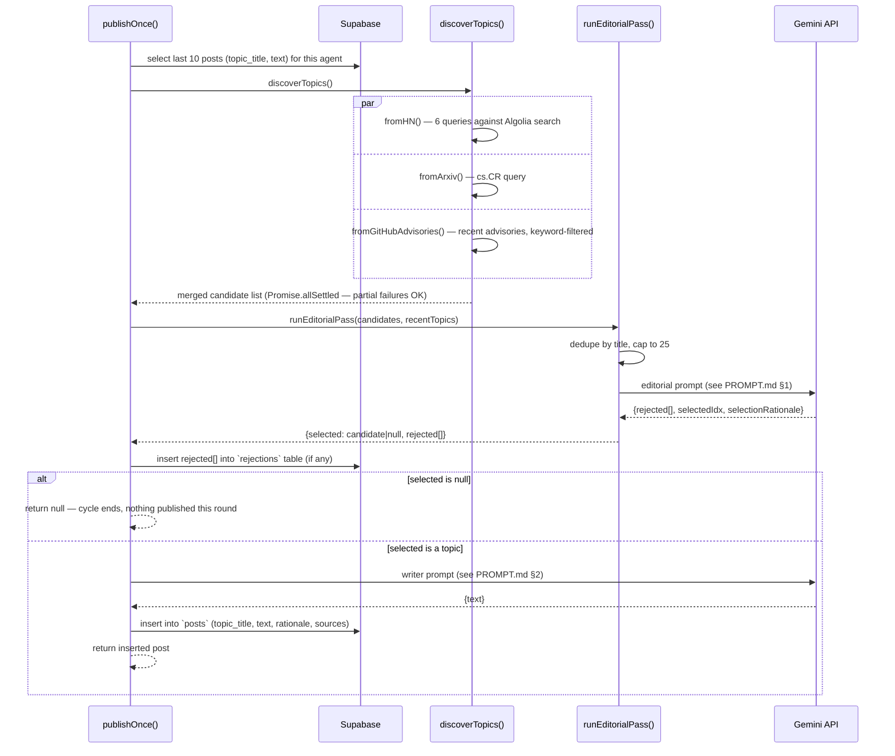

# WORKFLOW.md — Operational flows

Every path through the system, step by step. ARCHITECTURE.md says what the
pieces are; this says what happens, in order, when each one runs.

---

## 1. Init flow

Triggered exactly once, by the evaluator, before the 48h window starts.



Steps in `src/app/api/agent/init/route.ts`:

1. Parse the request body; `persona.name` / `persona.domain` are optional —
   default to `"Ada"` / `"AI Security"` if missing (this matches the
   brief's own example payload exactly).
2. Generate a UUID for the agent, insert into `agents` with
   `last_published_at` set equal to `created_at` (never left null — see
   ARCHITECTURE.md §3 for why the lock logic depends on this).
3. If the insert fails, return `500`. This is the one place a hard error
   is appropriate — the whole run can't proceed without an agent row.
4. Call `publishOnce(agentId)` **synchronously, but wrapped in try/catch**.
   A failure here (e.g. Gemini briefly unavailable) is logged and
   swallowed — the agent still exists and `agentId` is still returned. The
   feed will simply start empty and catch up on the next due cycle.
5. Return `{"agentId": ...}`.

**Why step 4 happens inside `init` and not deferred:** so the very first
`GET /feed` a judge makes isn't guaranteed-empty. It's the one exception
to "publishing happens lazily" — a single eager post, everything after it
spaced out normally.

---

## 2. Feed flow (the primary autonomy trigger)

Triggered repeatedly by the evaluator across the 48h window — this is the
*only* endpoint they're expected to call after init, per the spec.



Steps in `src/app/api/agent/feed/route.ts`:

1. Require `agentId` query param — `400` if missing.
2. Call `maybeCatchUpPublish(agentId)`, wrapped in try/catch (a failed
   catch-up should never make the feed itself unavailable — the evaluator
   still gets whatever posts already exist).
3. Query all posts for that agent, newest first.
4. Map DB rows to the exact response shape the spec requires (`id`,
   `createdAt`, `text`, `rationale`, `sources`) — see RULES.md §5.

---

## 3. Cron flow (backup trigger)



Identical catch-up logic to the feed flow, just iterated over every agent
that exists rather than the one the caller asked about. Exists purely to
cover a stretch where nobody happens to poll `/feed` for longer than
`PUBLISH_INTERVAL_MINUTES` — not required for correctness if the evaluator
polls regularly, which the spec says they will.

---

## 4. Full publish cycle (`publishOnce`, `src/lib/publish.ts`)

This is the actual work — what "catch-up" and "cron" both eventually call.



Step-by-step:

1. **Load memory.** Last 10 posts' `topic_title` (for the editorial
   "already covered" list) and `text` (only the last 3 are actually used,
   in the writer prompt — see PROMPT.md §2).
2. **Discover.** Three source fetchers run concurrently via
   `Promise.allSettled` — one failing source doesn't block the others.
   HN alone issues 6 separate queries (see `discovery.ts` for the exact
   query terms).
3. **Editorial pass.** Candidates are title-deduplicated and capped at 25,
   sent to Gemini with the persona rubric and recent-topics list. Returns
   a rejection list (with reasons) and at most one selection (with
   rationale). `selectedIdx: null` is a normal outcome, not an error path.
4. **Log rejections.** Every rejected candidate this cycle is inserted
   into `rejections` — happens whether or not a topic was ultimately
   selected, since "we discovered N things and rejected M of them for
   these reasons" is true even in a cycle that ends up publishing nothing.
5. **Short-circuit on no selection.** `publishOnce` returns `null`. No
   post is written. This is intentional — see RULES.md §2.
6. **Write.** Only reached if something was selected. One Gemini call,
   given the topic, the editorial rationale, the voice rules, and up to 3
   past posts for style continuity.
7. **Persist.** Insert into `posts`. `rationale` stored is the editorial
   model's `selectionRationale` plus the source name appended — this
   exact string is what the feed endpoint later returns verbatim.

---

## 5. Timing mechanics

- `PUBLISH_INTERVAL_MINUTES` (env, default `240`) is the only cadence knob.
- Interval is measured from `agents.last_published_at`, which is updated
  the moment a publish slot is *claimed* (before the cycle even runs), not
  after it completes. This means a slow cycle (e.g. a sluggish LLM
  response) doesn't cause the next interval to start late — the clock is
  anchored to when the slot was claimed, not when writing finished.
- If nothing gets discovered or everything gets rejected in a given cycle,
  the clock still advances (the slot was still claimed) — the next attempt
  waits a full interval rather than retrying immediately. Deliberate: an
  unattended system retrying in a tight loop against a possibly-degraded
  API is worse than trying again on the next natural cycle.
- Over a 48h window at the default interval: 1 immediate post from `init`,
  then roughly 11-12 further catch-up opportunities (48h / 4h), fewer of
  which than that will actually publish once editorial rejection is
  accounted for. Tune via `PUBLISH_INTERVAL_MINUTES` — see README.md's
  "one thing worth deciding" note on demo density.

---

## 6. Local development workflow

```bash
npm install
cp .env.example .env.local   # fill in SUPABASE_URL, SUPABASE_SERVICE_ROLE_KEY, GEMINI_API_KEY
npm run dev                  # http://localhost:3000
```

To exercise a full cycle locally without waiting for the interval:
temporarily set `PUBLISH_INTERVAL_MINUTES=0` in `.env.local`, hit
`POST /api/agent/init`, then `GET /api/agent/feed?agentId=...` twice in a
row — the second call should trigger another publish immediately. Set it
back before deploying.

## 7. Deployment workflow

```bash
vercel deploy               # first deploy, links the project
# add SUPABASE_URL, SUPABASE_SERVICE_ROLE_KEY, GEMINI_API_KEY,
# and optionally PUBLISH_INTERVAL_MINUTES / CRON_SECRET
# in the Vercel dashboard → Project → Settings → Environment Variables
vercel deploy --prod
```

Run `supabase/schema.sql` in the Supabase SQL editor **before** the first
deploy — the app assumes the tables already exist and does not create them
itself.

After deploying: call `init` once, confirm `agentId` comes back, then
poll `feed` once immediately to confirm the eager first post landed,
before handing the URL to evaluators.
